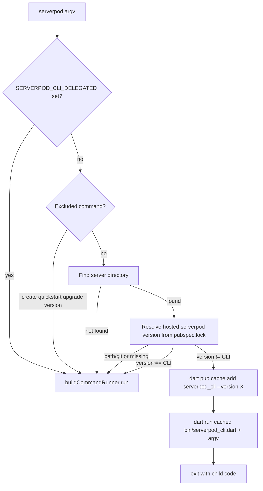

# Serverpod CLI version delegation

## Problem

The global `serverpod` CLI embeds a fixed `templateVersion` ([`tools/serverpod_cli/lib/src/generated/version.dart`](tools/serverpod_cli/lib/src/generated/version.dart)). Code generation and migrations must match the project's `serverpod` / `serverpod_client` packages. Today, [`generate`](tools/serverpod_cli/lib/src/commands/generate.dart) only **warns** via [`serverpod_packages_version_check.dart`](tools/serverpod_cli/lib/src/serverpod_packages_version_check/serverpod_packages_version_check.dart); users must reinstall or switch CLI versions manually.

## Approach

Insert a **pre-runner delegation layer** in [`tools/serverpod_cli/bin/serverpod_cli.dart`](tools/serverpod_cli/bin/serverpod_cli.dart) (after `initializeLogger()`, before `buildCommandRunner().run(args)`), so mismatched commands never execute on the wrong CLI.



## Scope (per your choice)

**Delegate** when a server directory is found (same detection as today via [`ServerDirectoryFinder`](tools/serverpod_cli/lib/src/util/server_directory_finder.dart) / [`isServerDirectory`](tools/serverpod_cli/lib/src/util/directory.dart)), for **any** subcommand except:

| Excluded | Reason |
|----------|--------|
| `create`, `quickstart` | Scaffold from **entry** CLI templates |
| `upgrade`, `version` (and global `--version`) | Manage / report the **installed** global CLI |
| `analyze-pubspecs`, `generate-pubspecs` | Internal monorepo tools (only valid at repo root) |

**Also delegate:** `run`, `mcp`, `language-server`, `completion`, etc., when run inside a project.

## New modules

### 1. [`tools/serverpod_cli/lib/src/version_delegate/project_serverpod_version.dart`](tools/serverpod_cli/lib/src/version_delegate/project_serverpod_version.dart)

Lightweight resolution (no `GeneratorConfig.load`, no `dart pub get` requirement):

1. Locate server dir with existing `serverpodDirectoryFinder` (non-interactive; catch `AmbiguousSearchException` → **no delegation**, let the command surface the error).
2. Read `{server}/pubspec.lock` via [`PubspecLockParser`](tools/serverpod_cli/lib/src/util/pubspec_lock_parser.dart).
3. Take locked `serverpod` package version when `PackageSource.hosted`.
4. **Skip delegation** when `serverpod` is `path` / `git` / missing (e.g. Serverpod monorepo development).
5. Optionally warn (debug/verbose) if `serverpod_client` lock version differs from `serverpod`.

Reuse the same package names as version check: `serverpod`, not `serverpod_cli`.

### 2. [`tools/serverpod_cli/lib/src/version_delegate/cached_cli.dart`](tools/serverpod_cli/lib/src/version_delegate/cached_cli.dart)

- `Future<void> ensureServerpodCliCached(Version version)` → `dart pub cache add serverpod_cli --version <version>` using [`getSdkPath()`](tools/serverpod_cli/lib/src/util/sdk_path.dart) (same pattern as [`UpgradeCommand`](tools/serverpod_cli/lib/src/commands/upgrade.dart) / upcoming `cloud` install).
- `File cachedCliEntrypoint(Version version)` → `$PUB_CACHE/hosted/pub.dev/serverpod_cli-${version}/bin/serverpod_cli.dart` (honor `PUB_CACHE` env; verify file exists after add).
- Prereleases use the full lock version string (e.g. `3.5.0-beta.9` → folder `serverpod_cli-3.5.0-beta.9`).

### 3. [`tools/serverpod_cli/lib/src/version_delegate/process_forwarder.dart`](tools/serverpod_cli/lib/src/version_delegate/process_forwarder.dart)

Extract the interactive child-process pattern from commit `bbdf844` (`cloud.dart`):

- `Process.start(dart, [entrypoint, ...args], workingDirectory: cwd)`
- Stream `stdout` / `stderr`, pipe `stdin`
- Forward `SIGINT` / `SIGTERM` (non-Windows)
- Propagate child `exitCode` via `ExitException`
- Set `SERVERPOD_CLI_DELEGATED=1` in child environment to **prevent infinite re-delegation**

When implementing alongside the `cloud` command branch, factor shared logic into this utility and reuse from both.

### 4. [`tools/serverpod_cli/lib/src/version_delegate/delegate.dart`](tools/serverpod_cli/lib/src/version_delegate/delegate.dart)

Orchestrator:

```dart
Future<bool> maybeDelegateToProjectCli(List<String> args) async
```

Returns `true` if the child ran and the entry process should exit (skip `buildCommandRunner`).

**Subcommand extraction:** walk `args` until the first non-option token (skip `-v`/`--verbose`, `--quiet`, `--interactive`, `--experimental-features` + value, etc.); treat `completion` sub-args similarly.

**Opt-out:** `SERVERPOD_CLI_NO_DELEGATE=1` for debugging.

**User-visible log** (info): `Using Serverpod CLI <version> for this project (global CLI is <cliVersion>).` before download/forward.

## Entry-point wiring

In [`serverpod_cli.dart`](tools/serverpod_cli/bin/serverpod_cli.dart) `_main`:

```dart
initializeLogger();
if (await maybeDelegateToProjectCli(args)) return;
await buildCommandRunner().run(args);
```

Delegation runs **before** `promptToUpdateIfNeeded` and command parsing, so users are not nudged to upgrade the global CLI when working on an older project.

## Version mismatch warnings

After delegation works, existing warnings in `generate` remain useful when versions **match** but lock/pubspec are inconsistent. When delegation succeeds, the **child** CLI matches the project and those warnings should largely disappear. No change required initially; optional follow-up: downgrade entry-level warnings to debug when delegation is available.

## Tests

Add under `tools/serverpod_cli/test/version_delegate/`:

| Test | Focus |
|------|--------|
| `project_serverpod_version_test.dart` | Lock parsing, path/git skip, missing lock |
| `delegate_test.dart` | Subcommand extraction, excluded commands, `SERVERPOD_CLI_DELEGATED` / `NO_DELEGATE` |
| `cached_cli_test.dart` | Path construction for `PUB_CACHE` + version strings |

Use temp dirs with fixture `pubspec.lock` files (pattern from [`serverpod_packages_version_check_test.dart`](tools/serverpod_cli/test/integration/serverpod_packages_version_check/serverpod_packages_version_check_test.dart)).

**Integration test (optional, CI-friendly):** mock `Process.start` via injectable `ProcessStarter` callback in `delegate.dart` to assert forwarded argv and env without network.

## Documentation

- [`tools/serverpod_cli/CHANGELOG.md`](tools/serverpod_cli/CHANGELOG.md): feat entry for automatic per-project CLI selection
- Short note in Serverpod docs (if there is an existing CLI install page) describing multi-version workflow and `SERVERPOD_CLI_NO_DELEGATE`

## Risks and mitigations

| Risk | Mitigation |
|------|------------|
| Infinite delegation | `SERVERPOD_CLI_DELEGATED=1` on child |
| Offline / pub add failure | Clear error; fall through or exit non-zero with hint to run `dart pub cache add` manually |
| Path/git `serverpod` dep | Skip delegation (current dev workflow unchanged) |
| Ambiguous server dirs | Skip delegation |
| First run downloads older CLI | One-time `pub cache add`; subsequent runs use cache |

## Files to touch (summary)

- [`tools/serverpod_cli/bin/serverpod_cli.dart`](tools/serverpod_cli/bin/serverpod_cli.dart) — hook
- New: `lib/src/version_delegate/{delegate,project_serverpod_version,cached_cli,process_forwarder}.dart`
- New: `test/version_delegate/*`
- [`tools/serverpod_cli/CHANGELOG.md`](tools/serverpod_cli/CHANGELOG.md)
- Later: refactor [`cloud.dart`](tools/serverpod_cli/lib/src/commands/cloud.dart) (when merged) to use `process_forwarder.dart`

## Unsolved questions

Investigation notes from design review of the initial implementation. These are open problems, not decisions.

### Interactive project finder

The delegation layer uses `ServerDirectoryFinder.search()` (non-interactive). Commands and `GeneratorConfig.load` use `ServerDirectoryFinder.findOrPrompt()` (interactive when multiple server projects are found).

- Does delegation need to call `findOrPrompt` before forwarding, honoring `--interactive` / `--no-interactive` and CI detection?
- When multiple server directories exist, the current implementation skips delegation entirely. The command may then prompt interactively and run on the **global** CLI — wrong version for the project the user selects.
- Should `--interactive` be parsed and applied during the pre-delegation project resolution step?

### Command-specific directory flags

Delegation runs before command parsing and only searches from `Directory.current`. It does not read command-level flags such as:

- `generate --directory` / `-d`
- `mcp --server-dir` / `-s`

- How much argv parsing is required pre-delegation to honor these flags?
- Should there be a shared helper that maps subcommand → directory flag name?

### Late vs early project resolution

If `findOrPrompt` only runs inside commands (after delegation), the entry CLI may delegate based on a different project than the command eventually uses — or skip delegation when ambiguity would have been resolved interactively later.

- Is a lightweight **project context** step (server dir + lock-file version) sufficient as the early resolution, without loading full `GeneratorConfig`?
- What is the minimal set of information that must be resolved before delegating?

### Full `GeneratorConfig` as a universal pre-step

Not all commands need `GeneratorConfig`:

| Needs full config | Project-scoped, config-light | Not project-scoped |
|-------------------|------------------------------|--------------------|
| `generate`, `start`, `migrate`, `create-migration`, `create-repair-migration` | `run`, `mcp` | `create`, `quickstart`, `upgrade`, `version`, `analyze-pubspecs`, `generate-pubspecs` |

`GeneratorConfig.load` also requires `dart pub get`, reads `generator.yaml`, resolves modules, etc. — heavier than version delegation needs.

- Should `GeneratorConfig` ever be promoted to a universal pre-command step?
- If not, should a thinner `ProjectContext` type be introduced and shared between delegation and commands to avoid duplicate resolution?

### Double prompt after early interactive resolution

If the entry CLI prompts the user to pick a server project, then delegates to a child CLI with the same argv and cwd, the child may hit the same ambiguity and prompt again.

- Should the resolved server directory be passed to the child (env var, injected `--directory`, or similar)?
- How do we keep entry and child resolution consistent without duplicating UX?

### Ambiguous layout + version mismatch

When multiple server projects exist and versions differ, skipping delegation means the user may interactively pick a project but still run the global CLI.

- Is skipping delegation on ambiguity the right default?
- Should delegation require interactive resolution instead of bailing out?

### Path/git `serverpod` dependencies

Delegation is skipped when the locked `serverpod` package is not hosted (path/git), e.g. Serverpod monorepo development.

- Is lock-file-only version resolution the right source of truth, or should pubspec constraints be a fallback when lock is missing?
- How should monorepo / path-dependency workflows behave?

### Version mismatch warnings after delegation

`generate` still warns when CLI and project package versions mismatch. Delegation largely makes those warnings redundant when forwarding succeeds.

- Should entry-level or generate-level warnings be downgraded or removed once delegation is reliable?
- What warnings remain useful when versions match but pubspec and lock are inconsistent?

### Shared process forwarding

Commit `bbdf844` introduces a `cloud` command that forwards to `scloud` with the same child-process pattern as delegation.

- Should `process_forwarder.dart` be reused by `cloud.dart` once that branch lands?
- Are there other external CLIs that should share the same utility?

